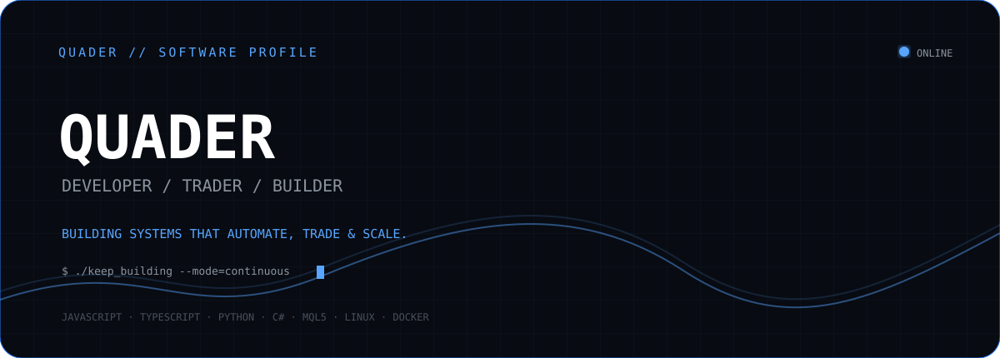
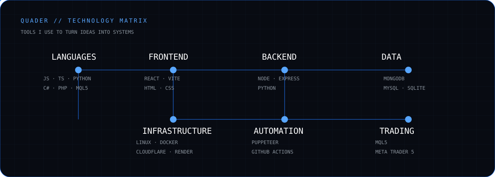
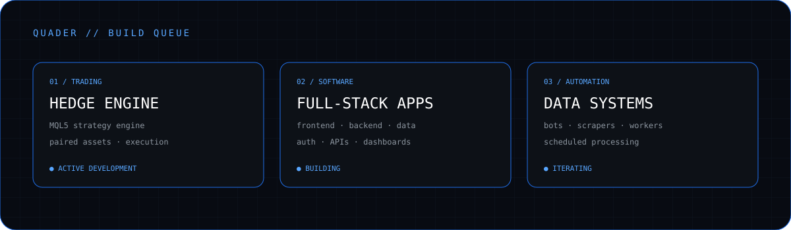
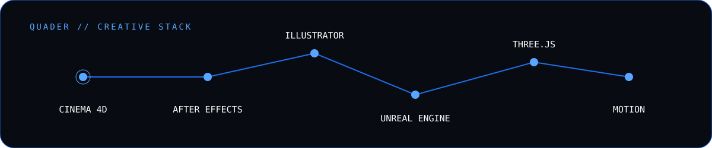

<div align="center">



<br>

<a href="https://quader864.ir"></a>
<a href="https://github.com/quader864"></a>
<a href="https://t.me/quader864"></a>
<a href="https://instagram.com/quader864"></a>

</div>

---

## `01` // ABOUT

I'm a developer who likes building **systems**, not just interfaces.

My work sits around software engineering, automation, algorithmic trading, backend systems, infrastructure, and creative technology.

I enjoy taking an idea from:

`concept → architecture → implementation → deployment → iteration`

Currently, most of my attention is going into **automated trading systems**, **full-stack applications**, and the infrastructure required to run them reliably.

> **Build it. Break it. Understand it. Improve it.**

---

## `02` // CURRENT FOCUS



---

## `03` // TECHNOLOGY MATRIX



### Core stack

| Domain | Technologies |
|---|---|
| **Languages** | JavaScript · TypeScript · Python · C# · PHP · MQL5 |
| **Frontend** | React · Vite · HTML · CSS · Tailwind |
| **Backend** | Node.js · Express · Python |
| **Data** | MongoDB · MySQL · SQLite |
| **Automation** | Puppeteer · GitHub Actions |
| **Infrastructure** | Linux · Docker · Cloudflare · Render |
| **Trading** | MQL5 · MetaTrader 5 |
| **Creative** | After Effects · Cinema 4D · Unreal Engine · Illustrator |

---

## `04` // WHAT I'M BUILDING



### `HEDGE ENGINE`

An automated dual-asset trading system written in **MQL5**.

The objective is to react to measurable market relationships rather than rely on discretionary prediction.

**Focus:** strategy engineering · execution · risk management · testing

---

### `FULL-STACK SYSTEMS`

Production-oriented web applications covering frontend, backend, authentication, databases, APIs, file handling, dashboards, reporting, and deployment.

**Focus:** architecture · UX · APIs · persistence · reliability

---

### `AUTOMATION & DATA`

Bots, scrapers, background workers, scheduled jobs, analytics pipelines, and integrations that turn repetitive operations into deterministic processes.

**Focus:** automation · data collection · processing · observability

---

## `05` // ENGINEERING PRINCIPLES

```text
┌──────────────────────────────────────────────────────────────────────┐
│                                                                      │
│   01  MEASURE        Prefer observable behavior over assumptions.    │
│                                                                      │
│   02  AUTOMATE       If a process repeats, make the system do it.   │
│                                                                      │
│   03  SIMPLIFY       Complexity is a liability until it is needed.  │
│                                                                      │
│   04  TEST           A feature is not finished because it works once.│
│                                                                      │
│   05  ITERATE        Build → inspect → fix → repeat.                │
│                                                                      │
└──────────────────────────────────────────────────────────────────────┘
```

---

## `06` // GITHUB ACTIVITY

<div align="center">


<br><br>


</div>

---

## `07` // BEYOND CODE



Code is only one part of the toolkit.

I also work with **motion design, 3D, visual effects, illustration, and real-time graphics**.

That background influences how I approach software: technical systems should work well, but the experience around them matters too.

---

## `08` // CURRENTLY LEARNING

<div align="center">

| AREA | DIRECTION |
|:---:|:---|
| `LINUX` | Servers · networking · system administration |
| `DOCKER` | Containers · images · deployment |
| `KUBERNETES` | Orchestration · distributed workloads |
| `DEVOPS` | CI/CD · automation · infrastructure |
| `THREE.JS` | Interactive 3D · creative web |
| `TRADING` | Strategy engineering · quantitative experimentation |

</div>

---

## `09` // CONNECT

<div align="center">

<a href="https://quader864.ir">

</a>

<a href="https://github.com/quader864">

</a>

<a href="https://t.me/quader864">

</a>

<a href="https://instagram.com/quader864">

</a>

<br><br>



</div>
